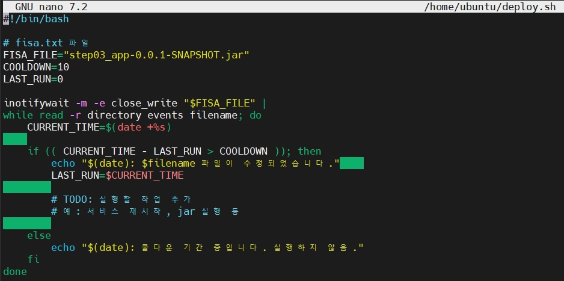
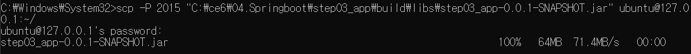
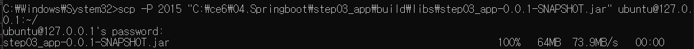
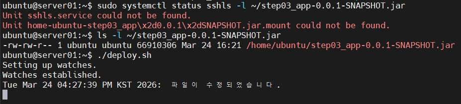

# 🚀 Spring Boot 자동 배포 파이프라인 구축 (Windows to Ubuntu)

본 repository는 Windows 개발 환경에서 빌드한 `app.jar` 파일을 가상머신(Ubuntu) 서버로 전송하고, 서버가 이를 실시간으로 감지하여 프로세스를 자동으로 재시작하는 **CI/CD의 기초 파이프라인**을 구현한 기록입니다.


## 🏗️ 시스템 아키텍처
1. **Local (Windows 11)**: STS(Spring Tool Suite)에서 코드 수정 및 빌드 (`.jar` 생성)
2. **Network (VirtualBox)**: 포트 포워딩 설정을 통해 호스트(Windows)와 게스트(Ubuntu) 연결
3. **Transfer (SCP)**: 빌드된 파일을 SSH 프로토콜로 서버에 전송
4. **Automation (Shell Script)**: inotify-tools를 활용해 파일 변경 감지 및 자동 재배포 실행


## 🛠️ 주요 설정 상세

### 1. VirtualBox 포트 포워딩 (SSH 연결)
외부에서 가상머신 내부 SSH 서비스(22번 포트)에 접근하기 위해 다음과 같이 설정하였습니다.
- **이름**: server01
- **프로토콜**: TCP
- **호스트 IP**: 127.0.0.1 / **호스트 포트**: 2015
- **게스트 IP**: 10.0.2.15 / **게스트 포트**: 22

### 2. 빌드 및 전송 (Windows Terminal)
코드 수정 후 빌드된 최신 파일을 서버의 홈 디렉토리로 전송합니다.
```
scp -P 2015 "C:\ce6\04.Springboot\step03_app\build\libs\step03_app-0.0.1-SNAPSHOT.jar" ubuntu@127.0.0.1:~/
```

### 3. 자동 감지 및 배포 스크립트
우분투 서버에서 실행되며, 파일이 덮어씌워지는 순간을 포착하여 서비스를 갱신합니다.

deploy.sh 작성



### 📈 실행 결과 확인
- STS 변경 사항: 컨트롤러의 Return 메시지 수정

- 배포 확인: scp 전송 직후 서버 터미널에서 파일이 수정되었습니다. 



- 자동 감지 확인
